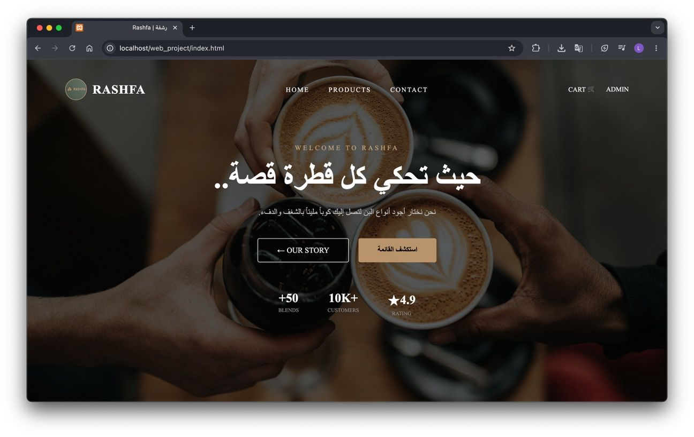
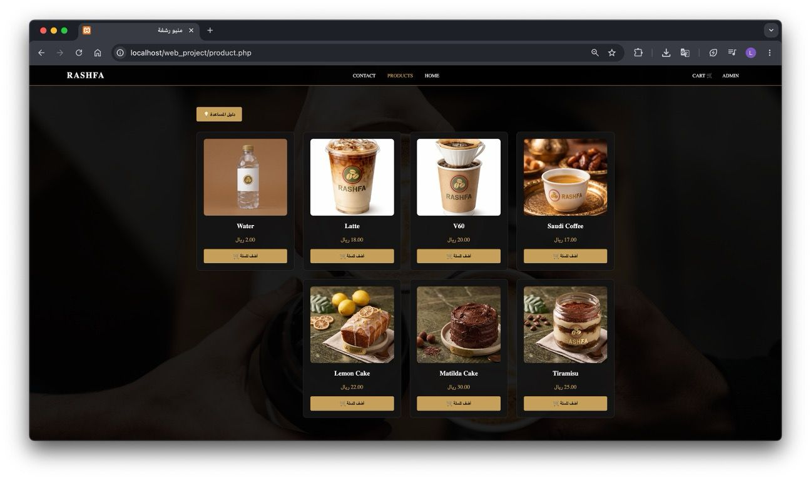
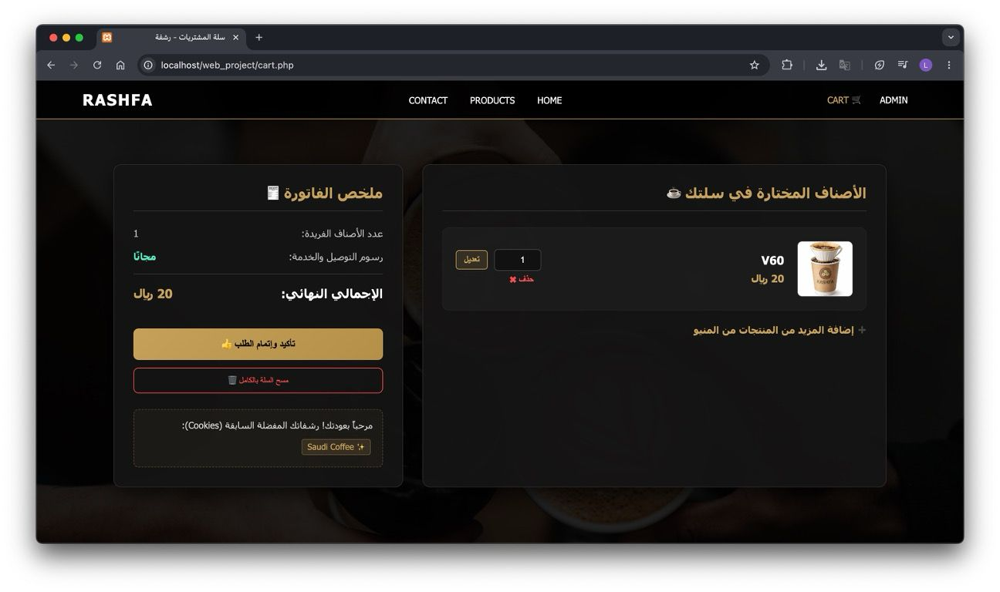
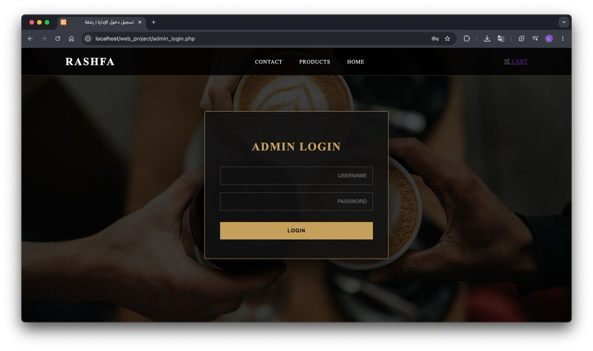
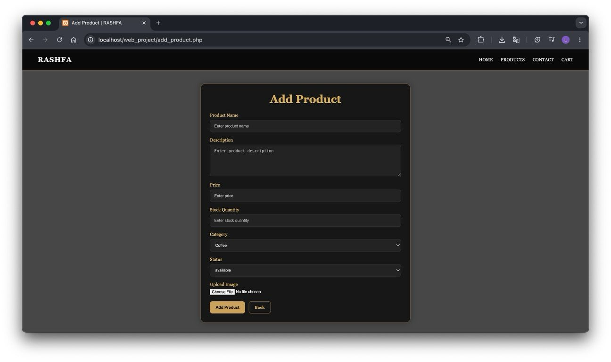
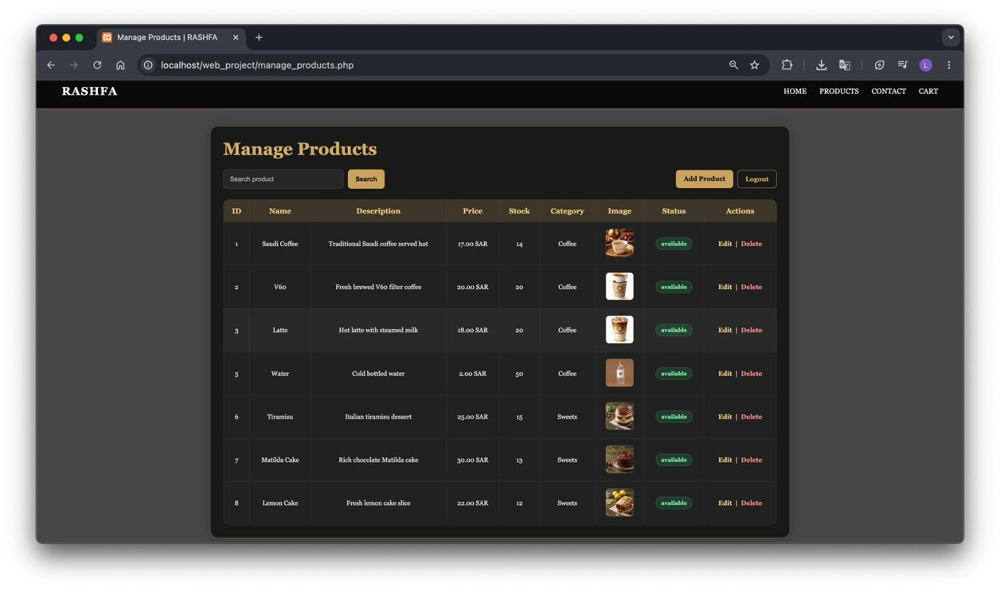
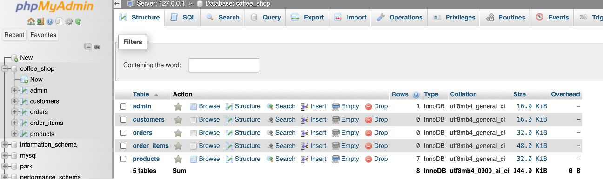
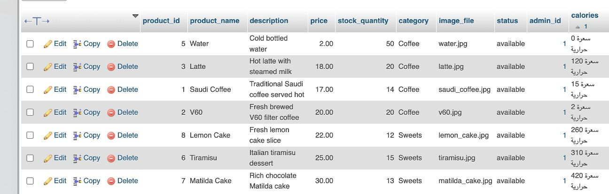
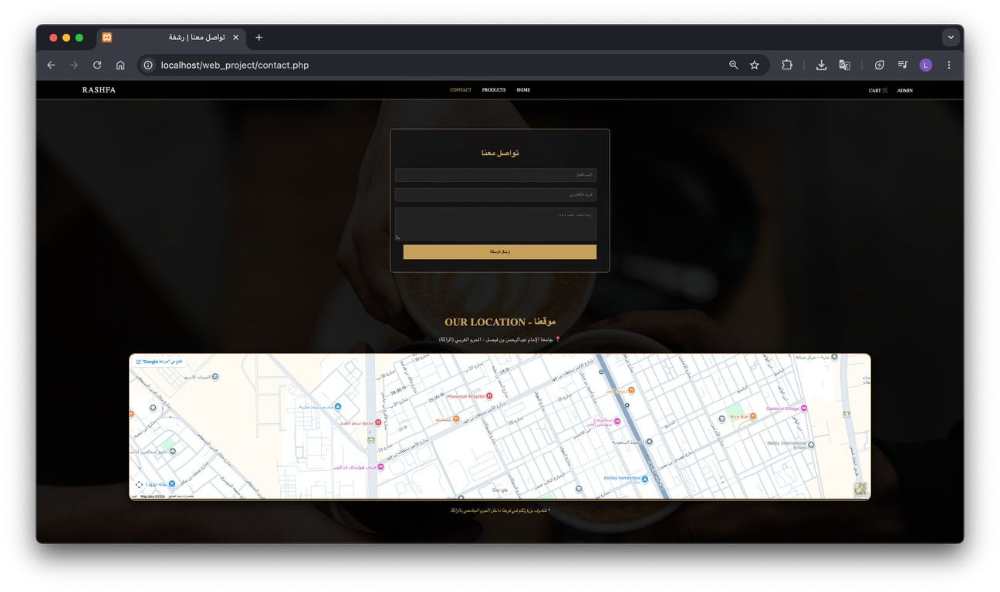

# Rashfah Coffee
Rashfah Coffee is a collaborative team project that delivers a web-based coffee ordering system. It enables users to browse the menu, register, log in, and place orders. The system integrates a MySQL database and uses cookies for session management. Tech Stack: HTML5, CSS3, JavaScript, PHP, MySQL.
## Screenshots

### Home Page

### Menu Page

### Shopping Cart

### Admin Login

### Add Product

### Manage Products

### Database Tables

### Database Products

### Contact Page

